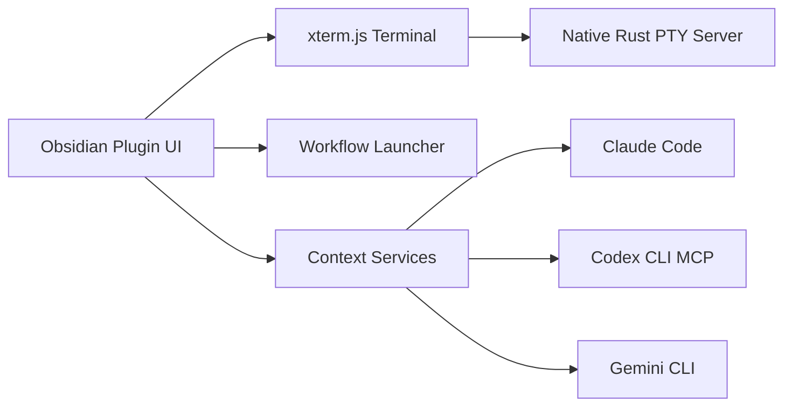

<div align="center">

# Termy


*A desktop-only terminal workspace for Obsidian*
Full terminal emulation for Obsidian with a native Rust PTY backend, split panes, reusable workflows, file-aware drag and drop, and AI CLI integrations.

[](./manifest.json)
[](https://obsidian.md/)
[](./LICENSE)
[](./rust-servers)

English / [简体中文](./README_ZH.md)

[Install](#installation) · [Quick Start](#quick-start) · [Features](#features) · [Screenshots](#visual-tour) · [Report Issues](https://github.com/ZyphrZero/Termy/issues) · [Telegram](https://t.me/+t6oRqhaw8c1jNzE1)

<p align="center">
  
</p>

</div>

---

## Why Termy?

Termy is built for people who already live in Obsidian and do real work in a terminal. It is designed as more than a terminal pane: it provides a workflow-oriented terminal environment that stays aligned with your vault, editor context, and AI coding sessions.

- **Native PTY backend**: Rust keeps the backend lean and avoids extra bridge runtimes.
- **Real terminal UX**: xterm.js frontend with search, copy/paste, prompt navigation, split panes, and multi-session support.
- **Workflow-driven automation**: Run reusable terminal, Obsidian-command, and external-link workflows from the status bar or command palette.
- **File-aware interactions**: Drag text, files, and folders into the terminal and open file references directly from terminal output.
- **AI-aware context handoff**: Claude Code and Codex CLI integrations can inherit active note context from Obsidian.
- **Desktop-first customization**: Shell selection, tab/split placement rules, theme sync, background images, blur, renderer controls, and Windows input handling.

## Features

### Terminal Workspace

- Run local shells directly inside Obsidian on Windows, macOS, and Linux.
- Use `cmd`, PowerShell, PowerShell Core, WSL, Git Bash, `bash`, `zsh`, or a custom shell path.
- Open terminals in the current tab, a new tab, left/right tab groups, horizontal/vertical splits, or a new window.
- Search terminal output, clear screen or buffer, resize fonts, navigate prompts, and copy/paste normally.
- Keep new terminals near existing terminal tabs, focus them automatically, or pin them on creation.

### Workflows & Launchers

- Create preset workflows with one or more ordered actions.
- Combine terminal commands, Obsidian commands, and external links in a single workflow.
- Launch workflows from the status bar menu, command palette, or built-in workflow commands.
- Decide whether each workflow appears in the status bar, opens a terminal, starts a fresh terminal instance, or renames the target tab.
- Start quickly with built-in launchers for Claude Code, Codex CLI, and Gemini CLI.

### Obsidian Interactions

- Send the current editor selection, full note, or active note path into the active terminal.
- Drag text, files, and folders into the terminal to paste content or resolved paths.
- Click file references printed by tools, agents, scripts, or compilers to reopen matching vault files or external paths.
- Open the bundled changelog from the command palette or settings.

### AI & Coding Integrations

- Claude Code sessions can receive active Obsidian file and selection context.
- Codex CLI integration can auto-register a local MCP server named `termy-context`.
- Codex context snapshots can include active file, current selection, open files, and vault/workspace metadata.
- MCP registration can stay in sync automatically, be re-registered manually, or be removed from settings.

### Appearance & Ergonomics

- Follow the Obsidian theme or use custom foreground and background colors.
- Choose Canvas or WebGL rendering, with automatic Canvas fallback when background images are enabled.
- Configure background image URL/path, opacity, size, position, blur amount, and text opacity.
- Use localized UI in English, Simplified Chinese, Japanese, Korean, and Russian.
- Tune Windows-friendly input behavior with `win32-input-mode` support for shells that depend on native key events.

## Visual Tour

<details open>
<summary><strong>Workspace preview</strong></summary>
<br />

<p align="center">
  
</p>

</details>

<details>
<summary><strong>Workflow UI</strong></summary>
<br />

<table>
  <tr>
    <td width="34%" align="center">
      
      <br />
      <sub>Status bar workflow launcher</sub>
    </td>
    <td width="66%" align="center">
      
      <br />
      <sub>Workflow configuration, instance behavior, and built-in launchers</sub>
    </td>
  </tr>
</table>

<p align="center">
  
  <br />
  <sub>Preset workflow editor with action ordering, notes, and context-awareness controls</sub>
</p>

</details>

<details>
<summary><strong>Theme customization</strong></summary>
<br />

<p align="center">
  
</p>

</details>

## Command Highlights

| Command | What it does |
| --- | --- |
| `Open Termy terminal` | Opens a new Termy instance using your configured placement rules. |
| `Termy: show changelog` | Opens the bundled changelog modal. |
| `Terminal: split horizontal / split vertical` | Splits the active terminal. |
| `Terminal: send selection` | Sends the current editor selection to the active terminal. |
| `Terminal: send current note` | Sends the full current note content. |
| `Terminal: send current path` | Sends the active note path. |
| `Terminal: previous prompt / next prompt` | Navigates prompt history. |
| `Terminal: last failed command` | Jumps to the most recent failed command when available. |

## Installation

### Requirements

- Obsidian Desktop
- Windows, macOS, or Linux

> [!WARNING]
> Termy is desktop-only because it uses a native PTY backend.

### Current Availability

Termy is **not currently listed in the official Obsidian Community Plugins registry**. Install it with BRAT or from GitHub Releases.

### Install with BRAT

1. Install [BRAT](https://github.com/TfTHacker/obsidian42-brat).
2. Open BRAT settings and choose **Add beta plugin**.
3. Enter `ZyphrZero/Termy`.
4. Install the plugin and enable it in **Settings → Community plugins**.

### Manual Install

1. Download the latest release from [GitHub Releases](https://github.com/ZyphrZero/Termy/releases).
2. Extract the release files into `.obsidian/plugins/termy/` inside your vault.
3. Reload Obsidian.
4. Enable Termy in **Settings → Community plugins**.

## Quick Start

1. Open Termy from the ribbon, command palette, empty-tab action, or status bar.
2. Choose your shell and terminal placement behavior in settings.
3. Try the built-in workflows from the status bar menu.
4. Send your current selection, note, or file path into the terminal.
5. Drag a file or folder into the terminal to paste its resolved path.
6. Click file references printed by tools or agents to jump back into the matching file.

## Development

```bash
pnpm install
pnpm build
pnpm build:rust
pnpm package:zip
```

| Script | Purpose |
| --- | --- |
| `pnpm dev` | Frontend build/watch flow. |
| `pnpm build` | TypeScript check, production bundle, and bundle smoke check. |
| `pnpm build:rust` | Build native PTY backend binaries. |
| `pnpm package:zip` | Create a release zip. |
| `pnpm install:dev <vault-path>` | Build everything and install into a local dev vault. |
| `pnpm test:terminal` | Compile and run terminal-layer Node tests. |

## Architecture



- **Frontend**: TypeScript, Obsidian plugin APIs, and xterm.js.
- **Backend**: Native Rust PTY server built on `portable-pty`.
- **Bridges**: Claude Code IDE bridge, Codex CLI context bridge, and local MCP registration.
- **Packaging**: Generated plugin assets are emitted as `main.js` and `styles.css`; native binaries are copied to `binaries/`.

## License

Termy is licensed under [GPL-3.0](./LICENSE).

## Credits

- [xterm.js](https://xtermjs.org/)
- [portable-pty](https://github.com/wez/wezterm/tree/main/pty)

---

<div align="center">

**Made with ❤️ for Obsidian power users**

If Termy helps your workflow, consider starring the project.

</div>


