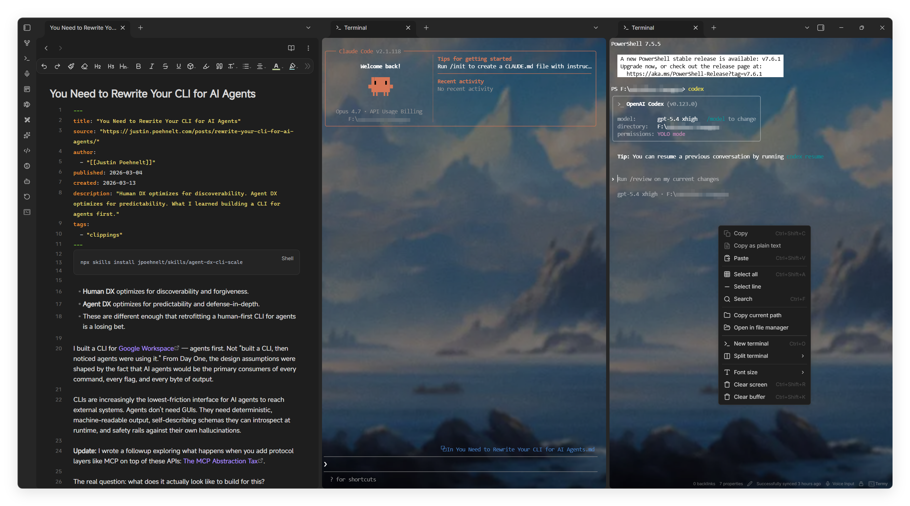
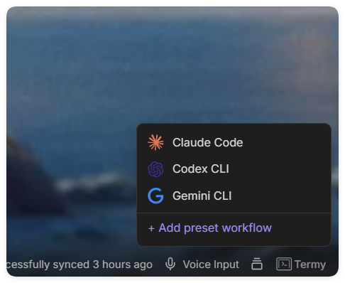
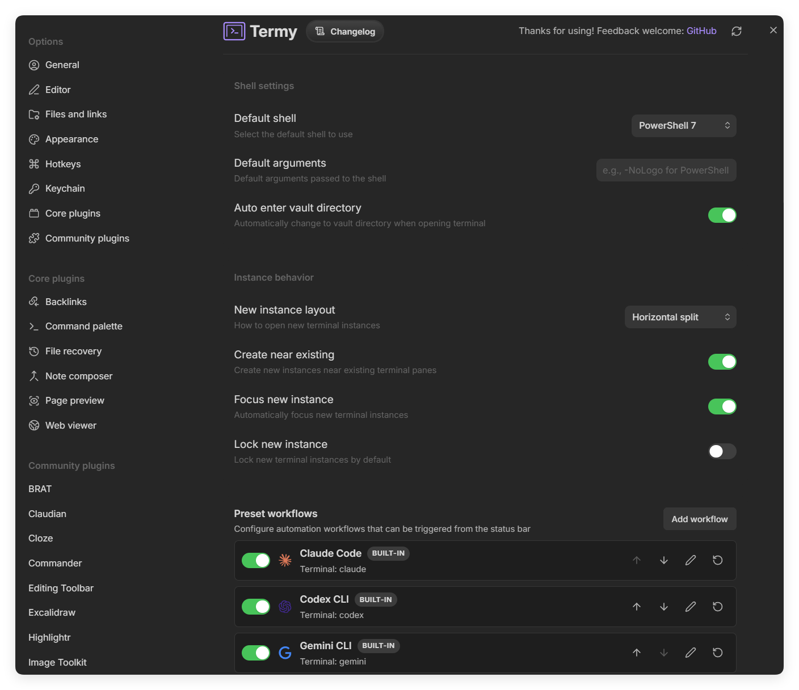
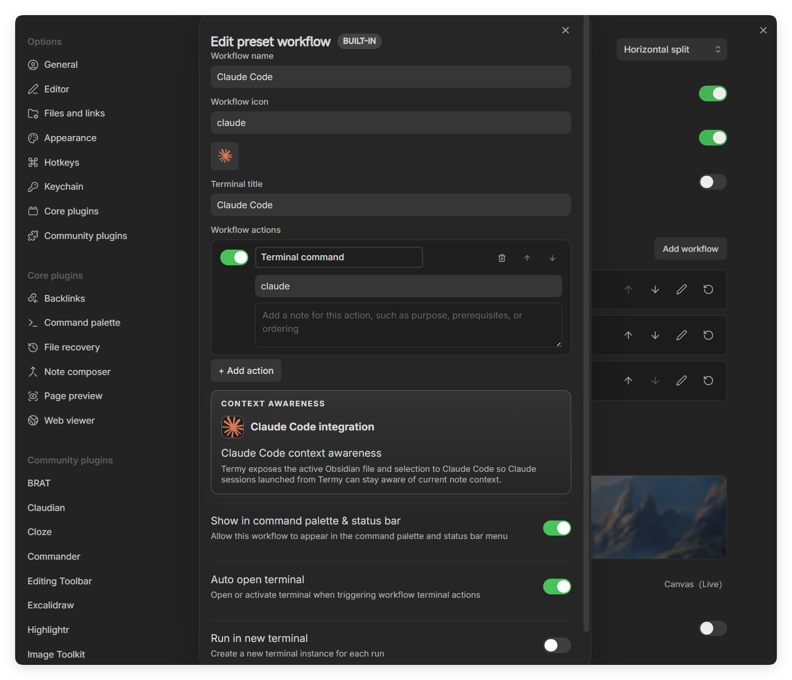
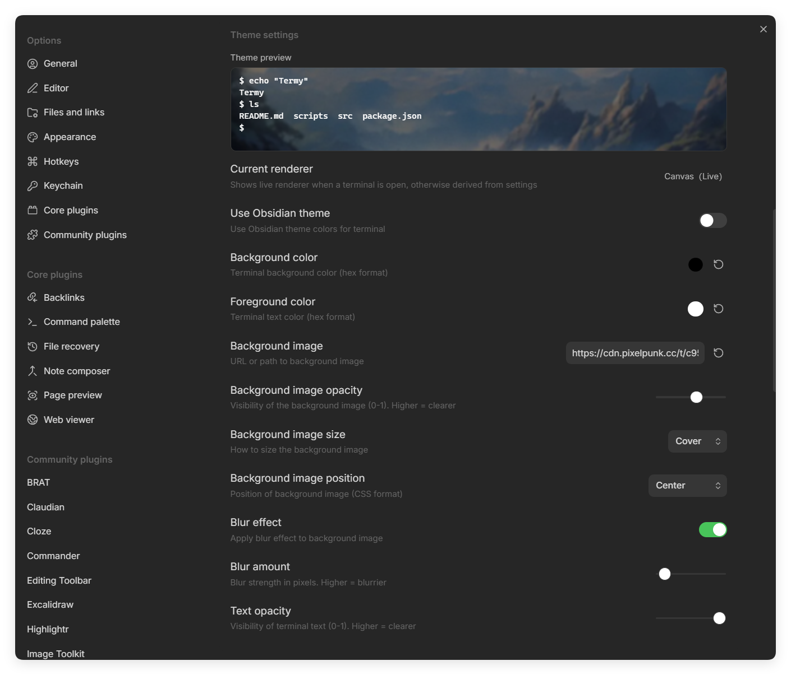

<div align="center">

# Termy


*A desktop-only terminal workspace for Obsidian*

Full terminal emulation for Obsidian with a native Rust PTY backend, split panes, reusable workflows, file-aware drag and drop, and AI CLI integrations.

English / [中文版](./README_ZH.md)

<p align="center">
  
</p>

</div>

## Why Termy

Termy is built for people who already live in Obsidian and do real work in a terminal.

- **Native PTY backend**: Rust keeps the backend lean and avoids extra bridge runtimes.
- **Real terminal UX**: xterm.js frontend with search, copy/paste, prompt navigation, split panes, and multi-session support.
- **Workflow launcher**: Run reusable terminal, Obsidian-command, and external-link workflows from the status bar or command palette.
- **File-aware interactions**: Drag text, files, and folders into the terminal and open file references directly from terminal output.
- **AI-ready workflows**: Claude Code and Codex CLI integrations can inherit active note context from Obsidian.
- **Desktop-first customization**: Shell selection, tab/split placement rules, theme sync, background images, blur, and renderer controls.

## Highlights

Termy is designed as more than a terminal pane:

- **Workflow-driven automation** with reusable preset workflows, multiple action types, enable toggles, notes, and terminal launch controls.
- **AI-aware context handoff** for Claude Code and Codex CLI so terminal sessions can stay aligned with the active note.
- **Editor-to-terminal actions** for sending the current selection, note content, or file path directly into the active terminal.
- **Clickable terminal file references** so paths emitted by tools, agents, or scripts can reopen the right file quickly.
- **Windows-friendly input handling** including `win32-input-mode` support for shells that depend on native key events.
- **Operational controls** for bundled changelog viewing and choosing native binary downloads from GitHub Releases or Cloudflare R2.

## What You Can Do

### Terminal experience

- Run local shells directly inside Obsidian on Windows, macOS, and Linux.
- Use `cmd`, PowerShell, PowerShell Core, WSL, Git Bash, `bash`, `zsh`, or a custom shell path depending on platform.
- Open terminals in the current tab, a new tab, left/right tab groups, horizontal/vertical splits, or a new window.
- Keep new terminals near existing terminals, focus them automatically, or pin them on creation.
- Search terminal output, clear screen or buffer, resize fonts, and copy/paste normally.

### Workflows and launchers

- Create **preset workflows** with one or more actions.
- Mix **terminal commands**, **Obsidian commands**, and **external links** in the same workflow.
- Launch workflows from:
  - the status bar menu
  - the command palette
  - built-in workflow commands
- Control whether a workflow:
  - appears in the status bar menu
  - auto-opens a terminal
  - runs in a brand-new terminal instance
  - renames the target terminal tab
- Built-in starter workflows include **Claude Code**, **Codex**, and **Gemini CLI** launchers.

<details>
<summary><strong>See workflow UI</strong></summary>
<br />

<table>
  <tr>
    <td width="34%" align="center">
      
      <br />
      <sub>Status bar workflow launcher</sub>
    </td>
    <td width="66%" align="center">
      
      <br />
      <sub>Workflow configuration, instance behavior, and built-in launchers</sub>
    </td>
  </tr>
</table>

<p align="center">
  
  <br />
  <sub>Preset workflow editor with action ordering, notes, and context-awareness controls</sub>
</p>

</details>

### Obsidian-aware interactions

- Send the current editor selection into the active terminal.
- Send the full current note into the active terminal.
- Send the current note path into the active terminal.
- Drag text, files, and folders into the terminal to paste content or resolved paths.
- Click file references in terminal output to reopen matching vault files or external paths.
- Open the bundled changelog from the command palette or settings.

### AI and coding integrations

- **Claude Code integration** exposes the active Obsidian file and selection to Claude sessions launched from Termy.
- **Codex CLI integration** can auto-register a local MCP server named `termy-context`.
- Codex context snapshots can include:
  - active file
  - current selection
  - open files
  - vault/workspace context
- Termy can keep the Codex MCP registration in sync automatically, re-register it manually, or remove it from settings.

### Appearance and ergonomics

- Follow the Obsidian theme or use custom foreground/background colors.
- Use Canvas or WebGL rendering, with automatic Canvas fallback when a background image is enabled.
- Set background image URL/path, opacity, size, position, blur amount, and text opacity.
- Localized UI support includes English, Simplified Chinese, Japanese, Korean, and Russian.

<details>
<summary><strong>See theme customization UI</strong></summary>
<br />

<p align="center">
  
</p>

</details>

## Visual Tour

<details>
<summary><strong>Expand screenshot gallery</strong></summary>
<br />

<table>
  <tr>
    <td width="60%">
      
    </td>
    <td width="40%">
      
    </td>
  </tr>
  <tr>
    <td width="50%">
      
    </td>
    <td width="50%">
      
    </td>
  </tr>
</table>

<p align="center">
  
</p>

</details>

## Command Highlights

Termy exposes more than just "open terminal". Useful built-in commands include:

| Command | What it does |
| --- | --- |
| `Open Termy terminal` | Opens a new Termy instance using your configured placement rules |
| `Termy: show changelog` | Opens the bundled changelog modal |
| `Terminal: split horizontal / split vertical` | Splits the active terminal |
| `Terminal: send selection` | Sends the current editor selection to the active terminal |
| `Terminal: send current note` | Sends the full current note content |
| `Terminal: send current path` | Sends the active note path |
| `Terminal: previous prompt / next prompt` | Navigates prompt history |
| `Terminal: last failed command` | Jumps to the most recent failed command when available |

## Installation

### Requirements

- Obsidian desktop
- Desktop OS: Windows, macOS, or Linux

### Current availability

Termy is **not currently listed in the official Obsidian Community Plugins registry**, so install it with BRAT or from GitHub Releases.

### Install with BRAT

1. Install [BRAT](https://github.com/TfTHacker/obsidian42-brat).
2. Open BRAT settings and choose **Add beta plugin**.
3. Enter `ZyphrZero/Termy`.
4. Install the plugin and enable it in **Settings -> Community plugins**.

### Manual install

1. Download the latest release from [GitHub Releases](https://github.com/ZyphrZero/Termy/releases).
2. Extract the release files into `.obsidian/plugins/termy/` inside your vault.
3. Reload Obsidian.
4. Enable Termy in **Settings -> Community plugins**.

## Quick Start

1. Open Termy from the ribbon, command palette, empty-tab action, or status bar.
2. Choose your shell and terminal placement behavior in settings.
3. Try the built-in workflows from the status bar menu.
4. Use the send commands to push your current selection, note, or file path into the terminal.
5. Drag a file or folder into the terminal to paste its resolved path.
6. Click file references printed by tools or agents to jump back into the matching file.

## Development

<details>
<summary><strong>Expand development notes</strong></summary>
<br />

```bash
pnpm install
pnpm build
pnpm build:rust
pnpm package:zip
```

Useful scripts:

- `pnpm dev`: frontend build/watch flow
- `pnpm build`: TypeScript check, production bundle, bundle smoke check
- `pnpm build:rust`: build native PTY backend binaries
- `pnpm package:zip`: create a release zip
- `pnpm install:dev`: build everything and install into a local dev vault

</details>

## Architecture

<details>
<summary><strong>Expand architecture overview</strong></summary>
<br />

- **Frontend**: TypeScript + Obsidian plugin APIs + xterm.js
- **Backend**: Native Rust PTY server built on `portable-pty`
- **Bridges**:
  - Claude Code IDE bridge
  - Codex CLI context bridge + local MCP registration

</details>

## License

GPL-3.0. See [LICENSE](LICENSE).

## Credits

- [xterm.js](https://xtermjs.org/)
- [portable-pty](https://github.com/wez/wezterm/tree/main/pty)

## Support

- Issues: [GitHub Issues](https://github.com/ZyphrZero/Termy/issues)
- Telegram Group: [Join the TG group](https://t.me/+t6oRqhaw8c1jNzE1)
