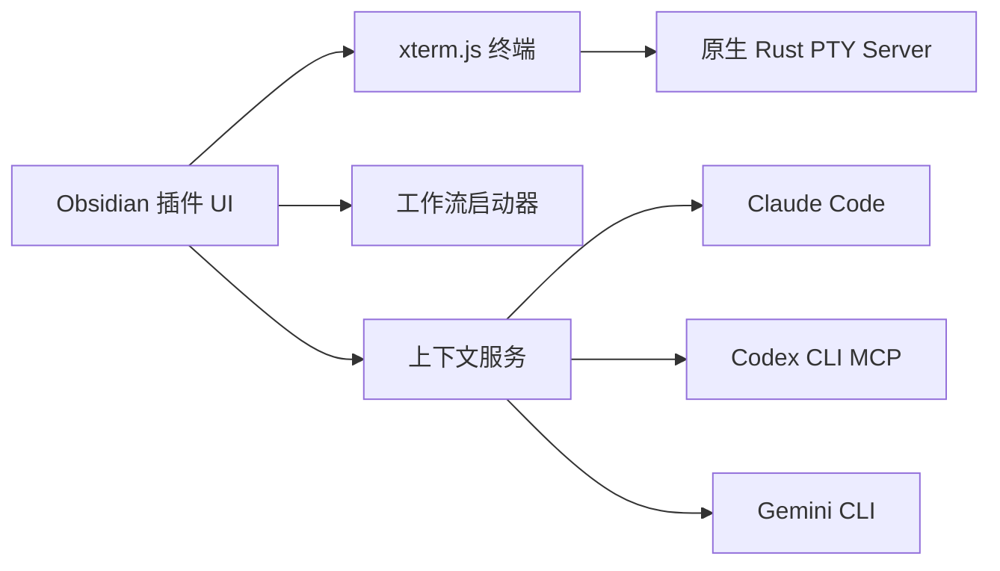

<div align="center">

# Termy


*面向 Obsidian 桌面端的终端工作区插件*
Termy 为 Obsidian 提供完整终端体验：原生 Rust PTY 后端、分屏、多会话、可复用工作流、文件感知拖拽，以及面向 AI CLI 的上下文集成

[](./manifest.json)
[](https://obsidian.md/)
[](./LICENSE)
[](./rust-servers)

简体中文 / [English](./README.md)

[安装](#安装) · [快速上手](#快速上手) · [功能特性](#功能特性) · [界面导览](#界面导览) · [问题反馈](https://github.com/ZyphrZero/Termy/issues) · [Telegram 群组](https://t.me/+t6oRqhaw8c1jNzE1)

<p align="center">
  
</p>

</div>

---

## 为什么用 Termy？

Termy 不是“把一个终端嵌进 Obsidian”这么简单，它更像是把命令行工作流真正带进了笔记环境。它围绕 Obsidian 工作流设计，让终端会话、编辑器上下文和 AI 编码工具保持在同一个工作空间中。

- **原生 PTY 后端**：Rust 后端更轻量，不依赖额外桥接运行时。
- **真实终端体验**：基于 xterm.js，支持搜索、复制粘贴、提示符导航、分屏和多终端会话。
- **工作流驱动自动化**：可从状态栏或命令面板执行终端命令、Obsidian 命令和外部链接组合工作流。
- **文件感知交互**：支持拖拽文本/文件/目录到终端，也支持从终端输出中直接点击文件引用返回 Obsidian。
- **AI 上下文接力**：支持 Claude Code 与 Codex CLI 在终端启动时继承当前笔记上下文。
- **桌面端定制完善**：Shell 选择、分屏/新标签行为、主题同步、背景图、模糊、渲染器切换和 Windows 输入处理都可配置。

## 功能特性

### 终端工作区

- 在 Obsidian 内直接运行本地 shell，支持 Windows、macOS 和 Linux。
- 可使用 `cmd`、PowerShell、PowerShell Core、WSL、Git Bash、`bash`、`zsh` 或自定义 shell 路径。
- 新终端可打开在当前标签页、新标签页、左/右侧标签组、水平/垂直分屏或新窗口。
- 支持终端搜索、清屏/清缓冲区、字号调整、提示符导航和正常复制粘贴。
- 可配置新终端是否靠近已有终端创建、是否自动聚焦、是否默认锁定标签页。

### 工作流与启动器

- 创建包含多个有序动作的预设工作流。
- 在同一个工作流中组合终端命令、Obsidian 命令和外部链接。
- 从状态栏菜单、命令面板或自动注册的工作流命令启动。
- 为每个工作流控制是否显示在状态栏、是否自动打开终端、是否每次新建终端实例，以及是否重命名目标标签页。
- 内置 Claude Code、Codex CLI 和 Gemini CLI 启动器，开箱即可接入常用 AI CLI。

### Obsidian 感知交互

- 将当前编辑器选区、整篇笔记或活动笔记路径发送到活动终端。
- 将文本、文件和目录拖拽到终端，自动粘贴文本或解析后的路径。
- 点击工具、Agent、脚本或编译器输出中的文件引用，快速打开匹配的库内文件或外部路径。
- 可从命令面板或设置中打开内置更新日志。

### AI 与编码集成

- Claude Code 会话可接收当前 Obsidian 文件和选区上下文。
- Codex CLI 集成可自动注册名为 `termy-context` 的本地 MCP server。
- Codex 上下文快照可包含活动文件、当前选区、已打开文件，以及 vault/workspace 元数据。
- 可在设置中自动同步 Codex MCP 注册、手动重新注册，或移除该注册。

### 外观与体验

- 可跟随 Obsidian 主题，也可自定义前景色和背景色。
- 支持 Canvas 或 WebGL 渲染；启用背景图时会自动回退到 Canvas。
- 可配置背景图 URL/路径、不透明度、尺寸、位置、模糊强度和文字透明度。
- UI 已支持英语、简体中文、日语、韩语和俄语。
- 支持 Windows 友好的 `win32-input-mode`，适配依赖原生按键事件的 shell。

## 界面导览

<details open>
<summary><strong>工作区预览</strong></summary>
<br />

<p align="center">
  
</p>

</details>

<details>
<summary><strong>工作流界面</strong></summary>
<br />

<table>
  <tr>
    <td width="34%" align="center">
      
      <br />
      <sub>状态栏工作流启动菜单</sub>
    </td>
    <td width="66%" align="center">
      
      <br />
      <sub>工作流配置、实例行为与内置启动项</sub>
    </td>
  </tr>
</table>

<p align="center">
  
  <br />
  <sub>预设工作流编辑器，支持动作顺序、备注与上下文感知配置</sub>
</p>

</details>

<details>
<summary><strong>主题定制</strong></summary>
<br />

<p align="center">
  
</p>

</details>

## 重点命令

| 命令 | 作用 |
| --- | --- |
| `Open Termy terminal` | 按当前实例布局策略打开一个新终端。 |
| `Termy: show changelog` | 打开内置更新日志弹窗。 |
| `Terminal: split horizontal / split vertical` | 对活动终端进行分屏。 |
| `Terminal: send selection` | 将当前编辑器选区发送到活动终端。 |
| `Terminal: send current note` | 将当前整篇笔记内容发送到活动终端。 |
| `Terminal: send current path` | 将当前文件路径发送到活动终端。 |
| `Terminal: previous prompt / next prompt` | 在提示符历史之间导航。 |
| `Terminal: last failed command` | 跳转到最近一次失败命令。 |

## 安装

### 环境要求

- Obsidian 桌面端
- Windows、macOS 或 Linux 桌面系统

> [!WARNING]
> Termy 使用原生 PTY 后端，因此仅支持 Obsidian 桌面端。

### 当前分发方式

Termy **尚未进入官方 Obsidian Community Plugins 列表**。请通过 BRAT 或 GitHub Releases 安装。

### 使用 BRAT 安装

1. 安装 [BRAT](https://github.com/TfTHacker/obsidian42-brat)。
2. 打开 BRAT 设置，选择 **Add beta plugin**。
3. 输入 `ZyphrZero/Termy`。
4. 安装插件，并在 **设置 → 社区插件** 中启用。

### 手动安装

1. 从 [GitHub Releases](https://github.com/ZyphrZero/Termy/releases) 下载最新发布包。
2. 解压到当前 vault 的 `.obsidian/plugins/termy/` 目录。
3. 重启或重新加载 Obsidian。
4. 在 **设置 → 社区插件** 中启用 Termy。

## 快速上手

1. 通过左侧 ribbon、命令面板、空标签页按钮或状态栏打开 Termy。
2. 在设置中配置 shell、终端创建位置和外观。
3. 从状态栏菜单试运行内置工作流。
4. 将当前选区、整篇笔记或当前路径发送到终端。
5. 拖拽一个文件或目录到终端，确认路径会被正确解析并插入。
6. 点击工具或 Agent 输出中的文件引用，直接跳回对应文件。

## 开发

```bash
pnpm install
pnpm build
pnpm build:rust
pnpm package:zip
```

| 脚本 | 用途 |
| --- | --- |
| `pnpm dev` | 前端构建/监听流程。 |
| `pnpm build` | TypeScript 检查、生产构建和 bundle smoke check。 |
| `pnpm build:rust` | 构建原生 PTY 后端二进制。 |
| `pnpm package:zip` | 生成发布压缩包。 |
| `pnpm install:dev <vault-path>` | 构建全部内容并安装到本地开发 vault。 |
| `pnpm test:terminal` | 编译并运行终端层 Node 测试。 |

## 架构概览



- **前端**：TypeScript、Obsidian Plugin API 和 xterm.js。
- **后端**：基于 `portable-pty` 的原生 Rust PTY server。
- **桥接**：Claude Code IDE bridge、Codex CLI context bridge 和本地 MCP 注册。
- **打包**：生成的插件资源位于仓库根目录的 `main.js` 和 `styles.css`；原生二进制复制到 `binaries/`。

## 许可证

Termy 使用 [GPL-3.0](./LICENSE) 许可证。

## 致谢

- [xterm.js](https://xtermjs.org/)
- [portable-pty](https://github.com/wez/wezterm/tree/main/pty)

---

<div align="center">

**用 ❤️ 为 Obsidian 用户构建**

如果 Termy 对你的工作流有帮助，欢迎给项目点一个 Star。

</div>


